# Capstone Project: Containerization and Container Orchestration

### Introduction

In today's fast-evolving tech landscape, containerization and container orchestration have become indispensable tools for streamlining application development and deployment. This capstone project, "Containerization and Container Orchestration," represents a significant milestone in my journey toward mastering modern DevOps practices. The project focuses on leveraging powerful tools like Docker and Kubernetes to create, manage, and scale containerized applications efficiently.

Through this hands-on experience, I aim to deepen my understanding of how container technology enhances portability and scalability while exploring the orchestration capabilities that simplify complex deployment workflows. This project is not just a technical exercise—it's a stepping stone for me as an aspiring DevOps engineer, equipping me with the practical skills and confidence to solve real-world challenges in IT and software development.

#### Objectives

•	Develop and containerize a simple web application.

•	Create and manage Docker containers for the application.

•	Deploy the containers to Kubernetes for orchestration.

•	Utilize Kubernetes features such as Deployments and Services to manage the application.

•	Gain hands-on experience in setting up a Kubernetes cluster using Kind (Kubernetes in Docker).

## Project Steps
### **Step 1: Set up your project**
- Note: For this project, I am using __Git Bash__ on a Windows workstation to execute these shell commands, as it provides a Unix-like command-line experience. Open your Git bash terminal.

**Task 1.1: create the project directory named Containerization-Project and navigate into it.**

**Commands:**
```bash
mkdir Containerization-Project
cd Containerization-Project
```
**Screenshot:** Project Directory


**Task 1.2: Build the Web Application**

  - Create an index.html file with the following content:

**Screenshot:** Index.html Content


  - Create a styles.css file with the following content:

**Screenshot:** Styles.css Content


### Step 2:
**Task 2.1: Initialize Git Repository**
  - Initialize a Git repository for version control:

**Commands:**
```bash
git init
git add .
git commit -m "Initial commit for static web app"
```
**Screenshot:** Git Repository
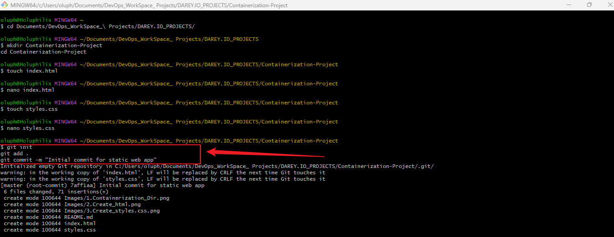

### Step 3: Docker Application Containerization
#### **Tasks: Set up Docker**

**Task 3.1: Update the package manager and install Docker**:

**Commands:**
```bash
sudo yum update -y
sudo yum install docker -y
```
**Screenshot:** Update package and Docker Installaion
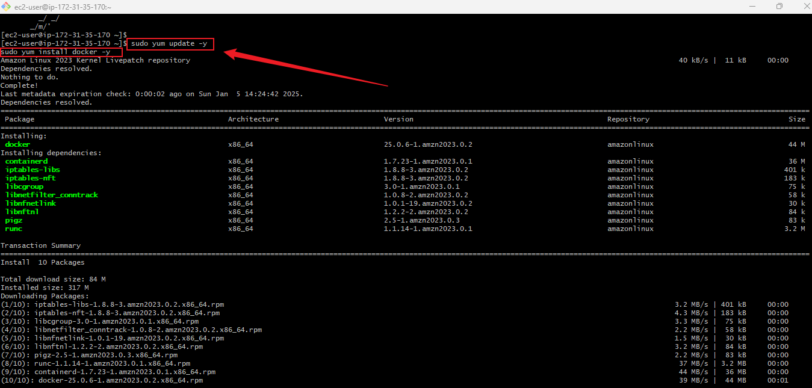

**Task 3.2: Start and enable the Docker service**:

**Commands:**
```bash
sudo service docker start
sudo systemctl enable docker
```
**Screenshot:** Start and Enable of docker
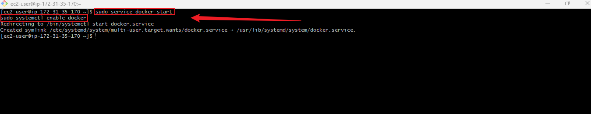

**Task 3.3: Add your current user to the Docker group (optional)**:

**Command:**
 ```bash
sudo usermod -aG docker $USER
```
**Screenshot:** Usermod $USER
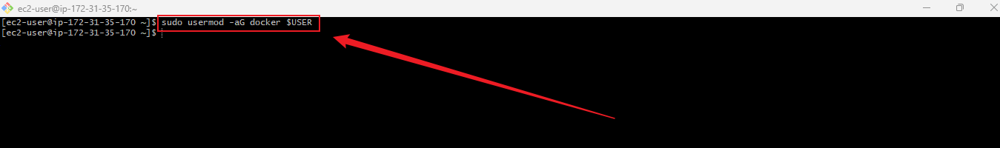

**Task 3.4: Verify the installation**

**Command:**
```bash
docker --version
```
**Screenshot:** You should see the installed Docker version as output.
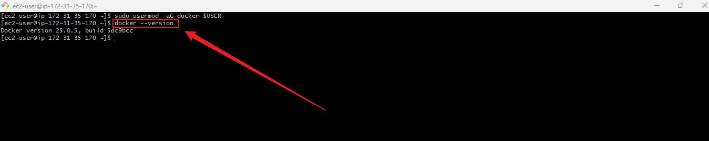

#### **Step 4: Create a Dockerfile**

 **Task 4.1: Create a working directory for your project**:

**Command:**
```bash
mkdir ~/nginx-capstone
cd ~/nginx-capstone
```
**Screenshot:** Project Directory
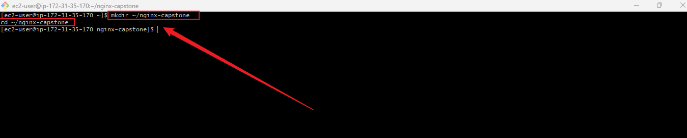

**Task 4.2: Create a index.html and Write the index.html content**:

**Command:**
```bash
nano index.hmtl content
```
**Screenshot:** Index.html

Save the file (Ctrl+O, Enter, Ctrl+X).

**Task 4.3: Create a styles.css and Write the styles.css content**:

**Command:**
```bash
nano styles.css
```
**Screenshot:** styles.css content

Save the file (Ctrl+O, Enter, Ctrl+X).

**Task 4.4: Create a Dockerfile and Write the Dockerfile content**:

**Command:**
```bash
nano Dockerfile
```
**Screenshot:** Dockerfile content
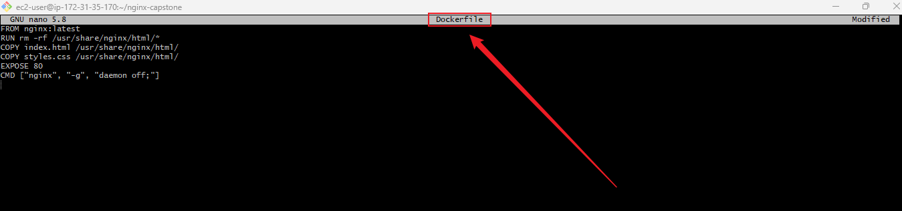
Save the file (Ctrl+O, Enter, Ctrl+X).

**Task 4:5 Build and Test the Docker Image**

  - **Build the Docker image**:

**Command:**
```bash
docker build -t nginx-capstone .
```
**Screenshot:** Docker Build -t
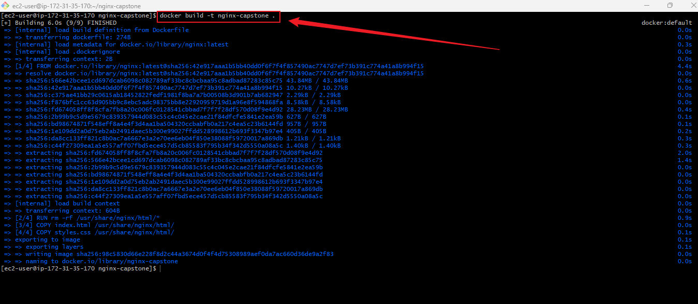

**Task 4:6: Verify the image build**:

**Command:**
```bash
docker images
```
**Screenshot:** You should see your image listed in the output.
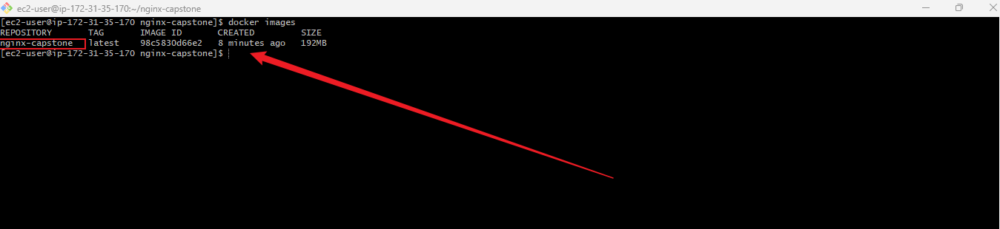

**Task 4.7: Run a container to test the image**:

**Command:**
```bash
docker run -d -p 80:80 --name nginx-capstone-container nginx-capstone
```
**Screenshot:** Run a Container 
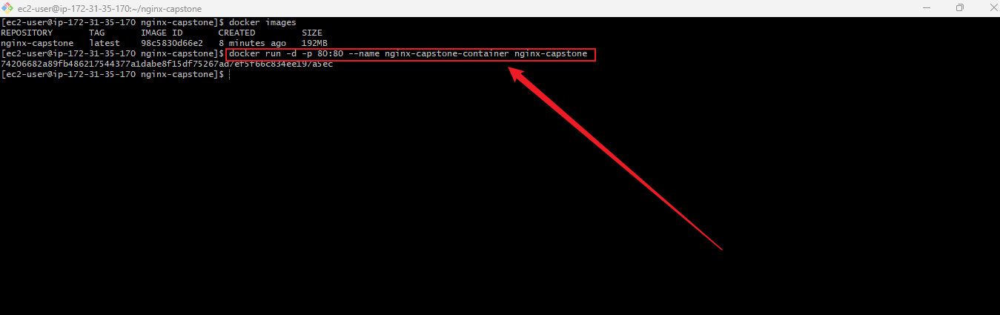

**Task 4.8: Check if the container is running**:

**Command:**
```bash
docker ps
```
**Screenshot:** Docker PS
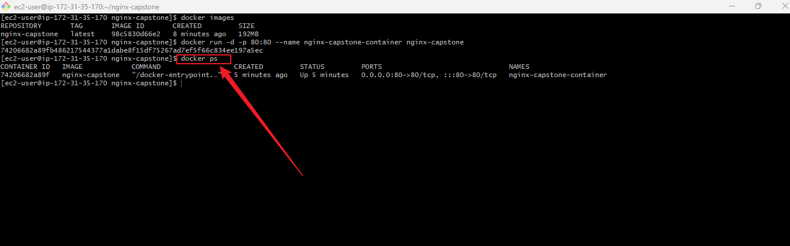

**Task 4.9: Test the application**:
Open your browser or use `curl` to verify the application is running:

**Command:**
```bash
curl http://52.91.181.8
```
**Screenshot:** Curl Status
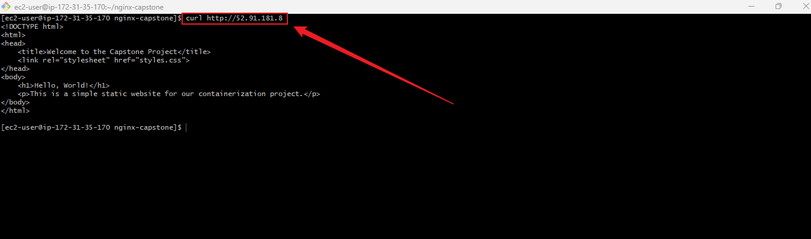

**Screenshot:** Browser status
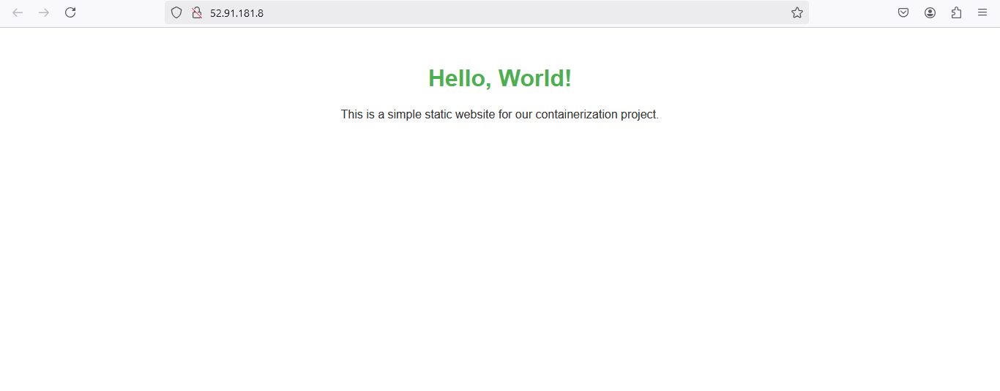

### **Step 5: Push the Docker Image to Docker Hub**

 **Task 5.1: Log in to Docker Hub**

**Command:**
```bash
docker login
```
**Screenshot:** Docker login
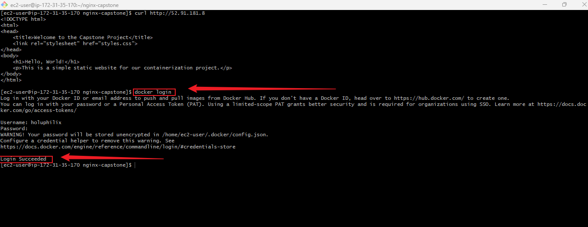

**Task 5.2: Tag your Docker image so it can be pushed to Docker Hub**

**Command:**
```bash
docker tag nginx-capstone holuphilix/nginx-capstone:latest
```
**Screenshot:** Docker Tag Image
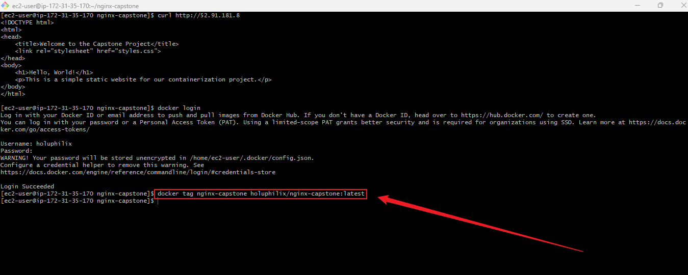

**Task 5.3: Push the Image to Docker Hub**

**Command:**
```bash
docker push holuphilix/nginx-capstone:latest
```
**Screenshot:** Docker Push
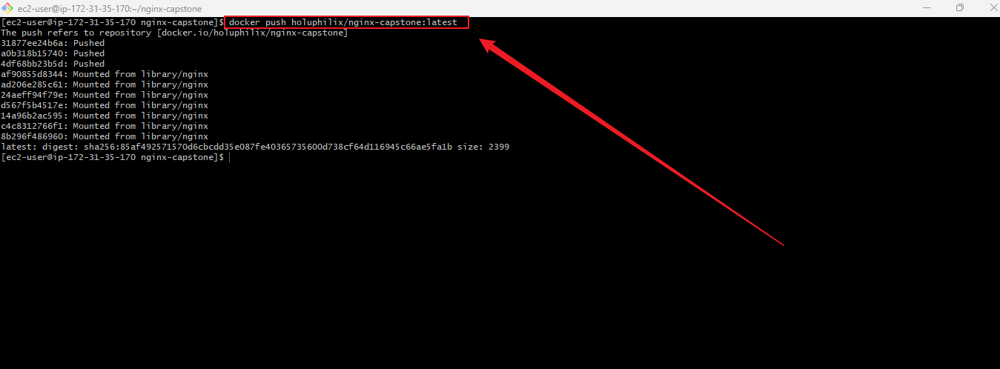

**Task 5.4: Verify the Image on Docker Hub**

After the push is complete, you can verify it on Docker Hub:

- Log in to your Docker Hub account in your web browser.
- Navigate to the "Repositories" section.
- You should see your nginx-capstone repository with the latest tag.
**Screenshot:** Docker Hub Repository
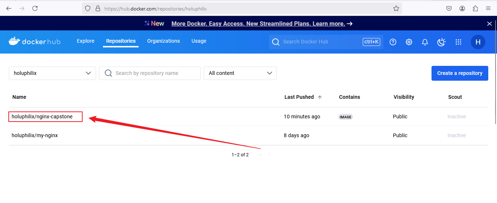

### **Step 6: Install Kind and Set Up a Kubernetes Cluster**

#### **Install Kind**

**Task 6.1: Download and install Kind**:

**Commands:**
```bash
curl -Lo ./kind https://kind.sigs.k8s.io/dl/v0.20.0/kind-linux-amd64
chmod +x ./kind
sudo mv ./kind /usr/local/bin/kind
```
**Screenshot:** Download and install Kind
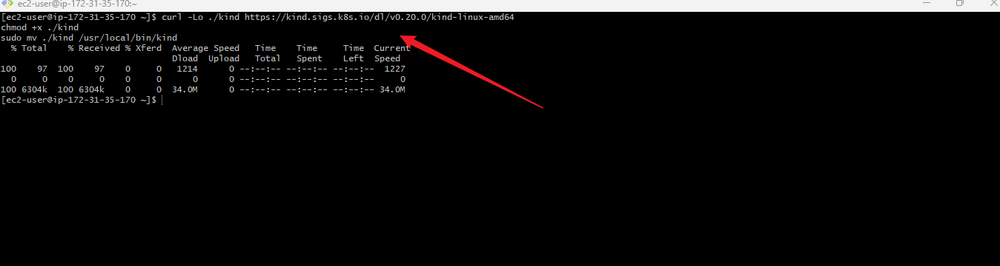

**Task 6.2: Verify the Kind installation**:

**Command:**
```bash
kind --version
```
**Screenshot:** Kind Version
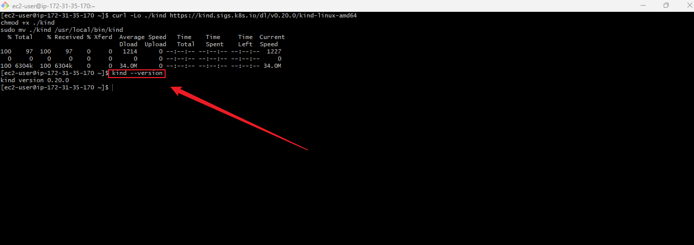

#### **Create a Kind Cluster**
**Task 6.3: Create the Kubernetes cluster**:

**Command:**
```bash
kind create cluster --name capstone-cluster
```
**Screenshot:** This will create a Kubernetes cluster named `capstone-cluster`.
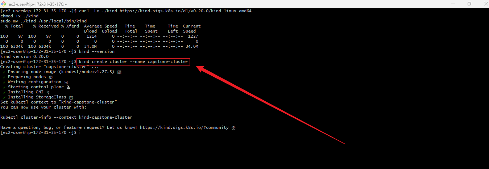

**Task 6.4: Check the cluster status**:

**Command:**
```bash
kubectl cluster-info
```
**Screenshot:** kubectl Cluster Info
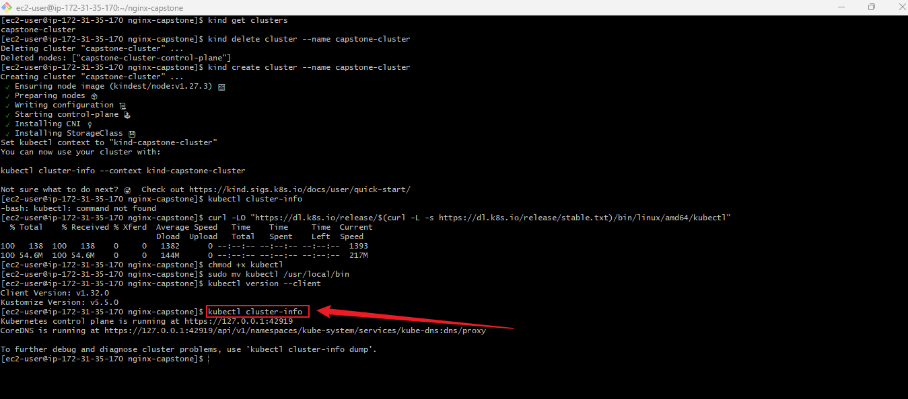

**Task 6.5: Verify the cluster nodes**:

**Command:**
```bash
kubectl get nodes
```
**Screenshot:** Kubectl Nodes
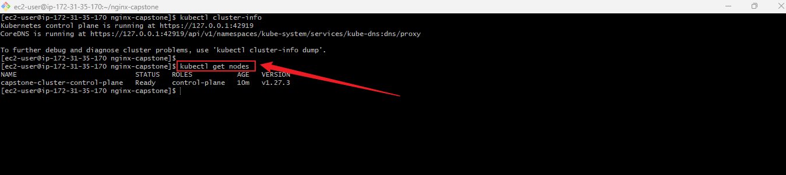

### **Step 7: Deploy the Application to Kubernetes**

**Task 7.1: Create a Kubernetes Deployment YAML file**

- Create a file named `deployment.yaml` with the following content:

**Screenshot:** deployment.yaml content
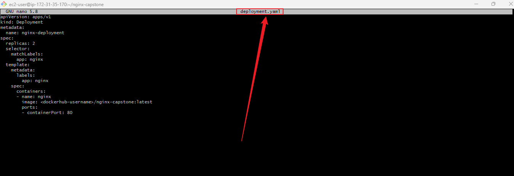

**Task 7.2: Apply the Deployment to the Cluster**
1. Apply the deployment:

**Command:**
```bash
kubectl apply -f deployment.yaml
```
**Screenshot:** apply -f deployment.yaml
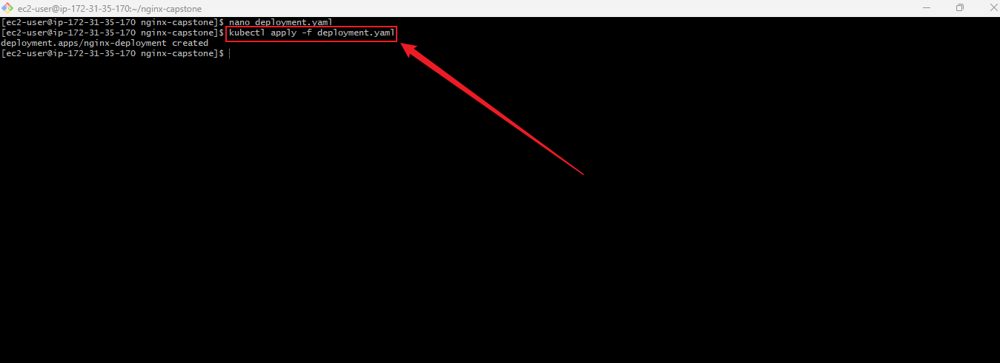

2. Verify the pods:

**Command:**
```bash
kubectl get pods
```
**Screenshot:** Verify of pods
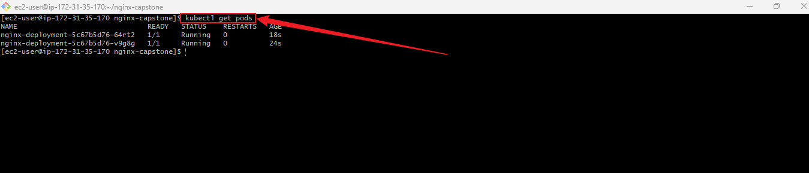

### **Step 8: Create a Service (ClusterIP)**

**Task 8.1: Create a Service YAML file**
- Create a file named `service.yaml` with the following content:

**Screenshot:** service.yaml content
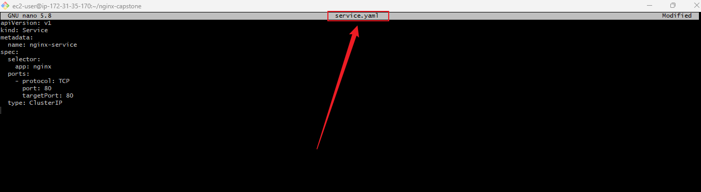

**Task 8.2: Apply the Service to the Cluster**
1. Apply the service:

**Command:**
```bash
kubectl apply -f service.yaml
```
**Screenshot:** apply -f service.yaml
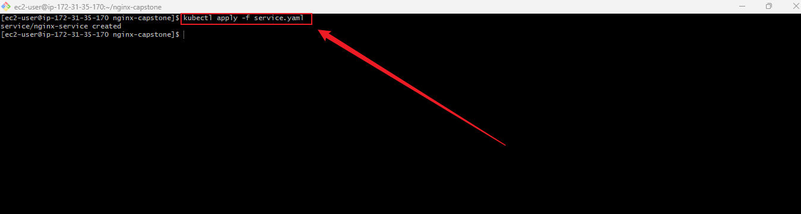

2. Verify the service:

**Command:**
```bash
kubectl get services
```
**Screenshot:** kubectl get service
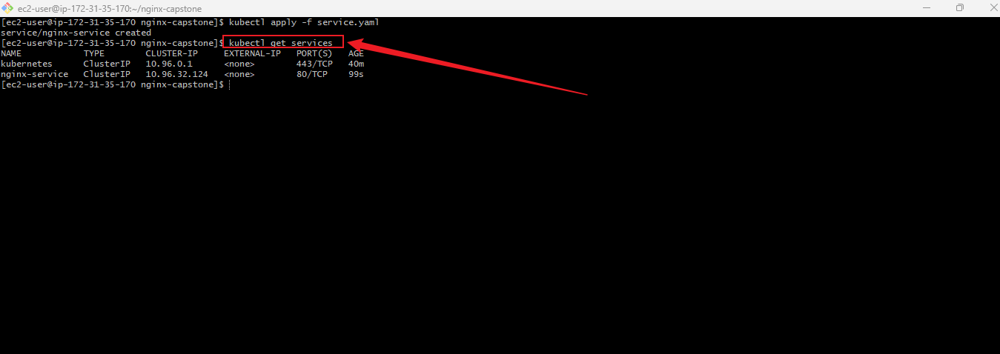

### **Step 9: Access the Application**

**Task 9.1: Port-forward to the Service**
1. Forward the port of the `nginx-service` to your local machine:

**Command:**
```bash
 kubectl port-forward --address 0.0.0.0 service/nginx-service 8080:80
```
**Screenshot:** port-Forward to the service
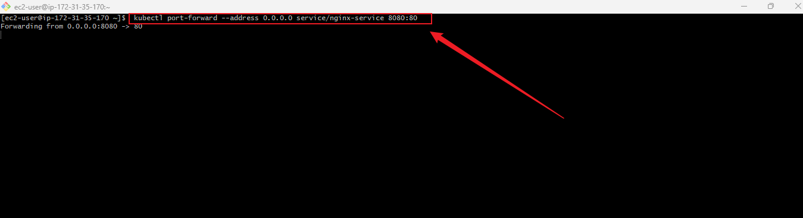

2. Open your browser and visit:

**Command:**
```bash
http://18.234.67.4:8080/
```
You should see your **Hello, World!** frontend application.
**Screenshot:** localhost
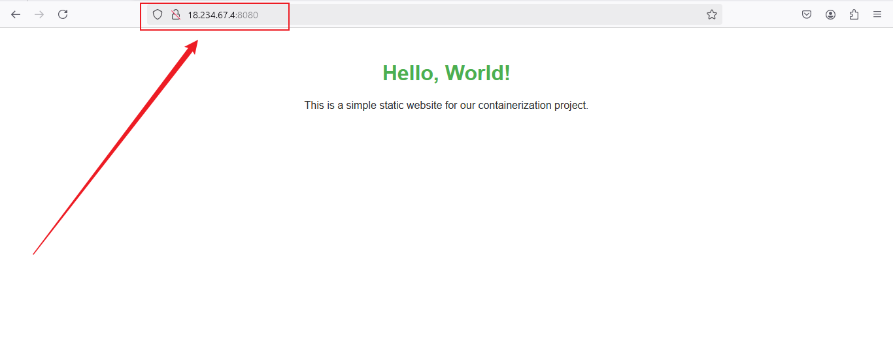

### **Optional: Check the Logs**
To check the logs of the running pods:

**Command:**
```bash
kubectl logs nginx-deployment
```
**Screenshot:** kubectl logs nginx-deployment-5c67b5d76-64rt2
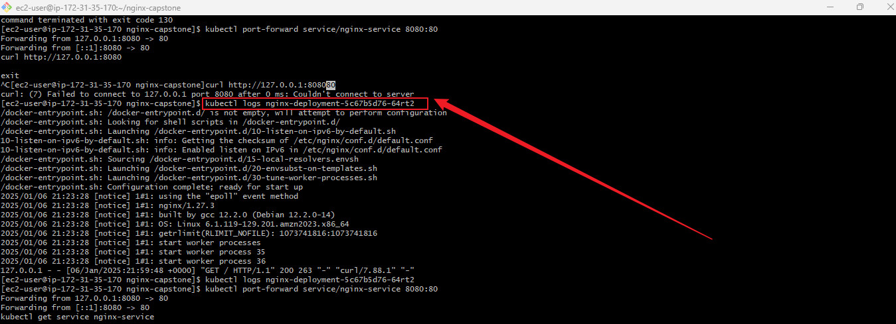

### **Step 10: Stage, Commit, and Push Your Project to GitHub**

**Task 10.1: Stage and Commit the Template to Git**

In this step, I will add the website files to the Git repository, configure my global Git settings, and make an initial commit with a descriptive message.

- **Add Files:** Add all website files to the staging area.

- **Configure Git User Information:** Set up global configuration with my actual git username and email address.

- **Commit Changes:** Commit the changes with a clear and descriptive message.

**Commands:**
```bash
git add .
git config --global user.name "YourUsername"
git config --global user.email "youremail@example.com"
git commit -m "Initial commit for static web app"
```
**Screenshot:** Git Config and Commit
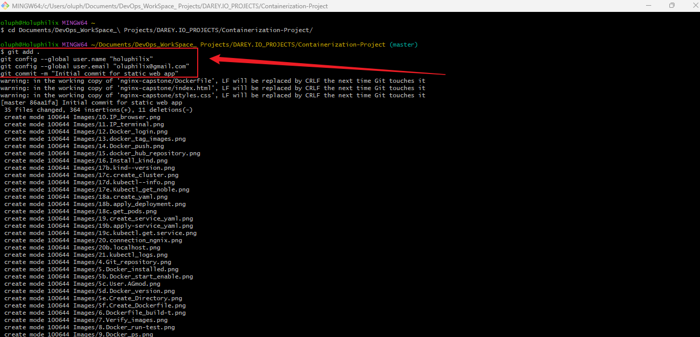

**Task 10.2: Push the code to your Github repository**

After initializing your Git repository and adding your e-commerce website template, the next step is to push your code to a remote repository on GitHub. This step is crucial for version control and collaboration.

- Create a Remote Repository on GitHub: Log into your GitHub account and create a new repository named **Containerization-Project**. Leave the repository empty without initializing it with a README, .gitignore, or license.
**Screenshot:** Create Git Repository Account
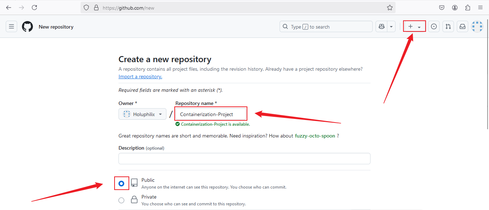

- **Link Your Local Repository to GitHub:** In your terminal, within your project directory, add the remote repository URL to your local repository configuration.

- **Push Your Code:** Upload Your Local Repository Content to GitHub Once you have linked your local repository to GitHub, use the following command to push your commits from your local main branch to the remote repository. This enables you to store your project in the cloud and share it with others.
**Screenshot:** 
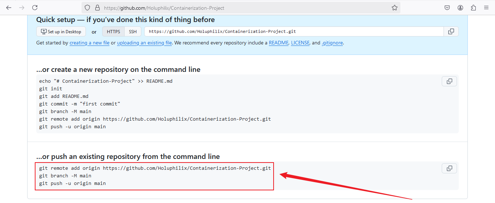

**Commands:**
```bash
git remote add origin https://github.com/Holuphilix/Containerization-Project.git
git branch -M main
git push -u origin main
```
**Screenshot:** Git remote and push to origin maintain
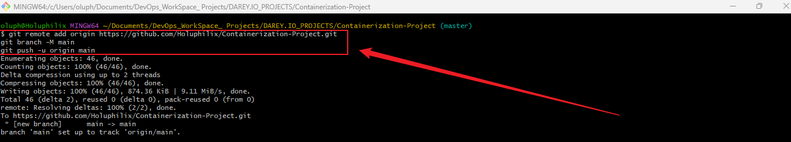
