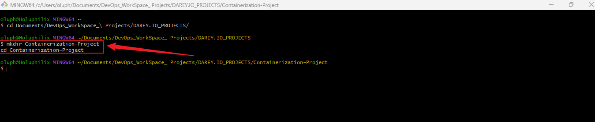
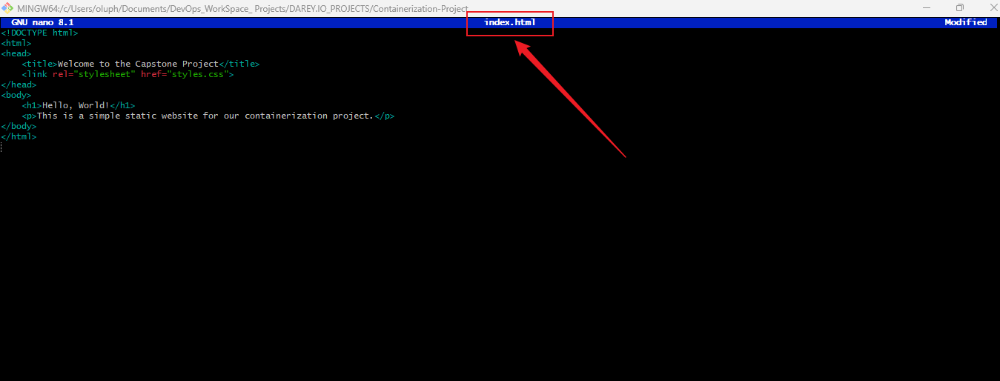
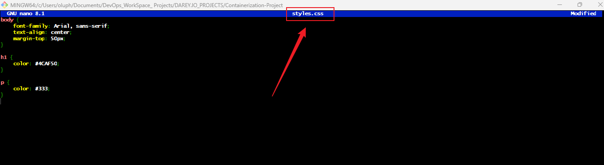

# Capstone Project: Containerization and Container Orchestration

### Introduction

In today's fast-evolving tech landscape, containerization and container orchestration have become indispensable tools for streamlining application development and deployment. This capstone project, "Containerization and Container Orchestration," represents a significant milestone in my journey toward mastering modern DevOps practices. The project focuses on leveraging powerful tools like Docker and Kubernetes to create, manage, and scale containerized applications efficiently.

Through this hands-on experience, I aim to deepen my understanding of how container technology enhances portability and scalability while exploring the orchestration capabilities that simplify complex deployment workflows. This project is not just a technical exercise—it's a stepping stone for me as an aspiring DevOps engineer, equipping me with the practical skills and confidence to solve real-world challenges in IT and software development.

Objectives
•	Develop and containerize a simple web application.
•	Create and manage Docker containers for the application.
•	Deploy the containers to Kubernetes for orchestration.
•	Utilize Kubernetes features such as Deployments and Services to manage the application.
•	Gain hands-on experience in setting up a Kubernetes cluster using Kind (Kubernetes in Docker).

### Project Steps
#### Task 1:
- Note: For this project, I am using __Git Bash__ on a Windows workstation to execute these shell commands, as it provides a Unix-like command-line experience. Open your Git bash terminal.

- create the project directory named Containerization-Project and navigate into it.

**Commands:**
```bash
mkdir Containerization-Project
cd Containerization-Project
```
**Screenshot:** 



- Build the Web Application

  - Create an index.html file with the following content:

**Screenshot:** 



  - Create a styles.css file with the following content:

**Screenshot:** 



- Initialize Git Repository

